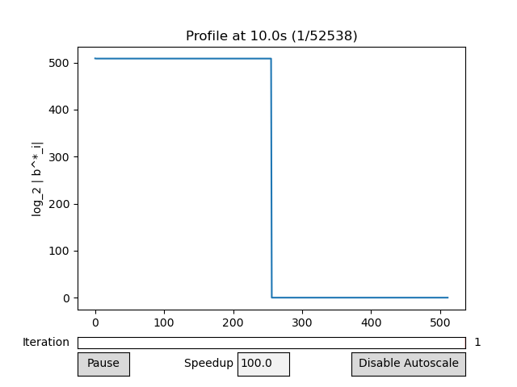
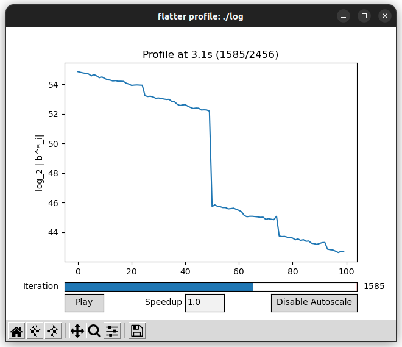

# flatter #
flatter is a library for performing (f)ast (lat)tice (r)eduction of integer lattice bases. It implements the iterated compression algorithm in "Fast Practical Lattice Reduction through Iterated Compression" and efficiently achieves reduced lattice bases of analogous quality to the LLL algorithm. The flatter library is able to efficiently reduce lattice bases of dimension over 1000 and entries of millions of bits.



[Additional examples.](docs/example_profiles.md)

# Usage #
```
$ flatter -h
Usage: flatter [-h] [-v] [-alpha ALPHA | -rhf RHF | -delta DELTA] [-logcond LOGCOND] [INFILE [OUTFILE]]
	INFILE -	input lattice (FPLLL format). Defaults to STDIN
	OUTFILE -	output lattice (FPLLL format). Defaults to STDOUT
	-h -	help message.
	-v -	verbose output.
	-q -	do not output lattice.
	-p -	output profiles.
	Reduction quality - up to one of the following. Default to RHF 1.0219
		-alpha ALPHA -	Reduce to given parameter alpha
		-rhf RHF -	Reduce analogous to given root hermite factor
		-delta DELTA -	Reduce analogous to LLL with particular delta (approximate)
	-logcond LOGCOND -	Bound on condition number.
```

flatter reduces lattice bases specified in the fplll format.
```
$ latticegen q 4 2 10 b | flatter
[[4 -1 1 0]
[2 10 8 2]
[1 4 -5 -13]
[4 4 -12 12]
]
```
Optionally, information about the input and output bases can be printed.
```
$ latticegen q 4 2 10 b | flatter -q -v -p
Input lattice of rank 4 and dimension 4
Largest entry is 7 bits in length.
Skipped determining input profile, as input is not lower-triangular.
Target reduction quality alpha = 0.0625081, rhf = 1.0219
Reduction took 84 milliseconds.
Output profile:
2.08496 3.7047 3.84562 4.08069
Achieved reduction quality alpha = 0, rhf = 0.792231
```

flatter is faster than fplll for most lattice bases.
```
$ latticegen q 100  50 100 b > qary_tiny.lat
$ latticegen q 200 100 200 b > qary_small.lat
$ latticegen q 300 150 300 b > qary_medium.lat
$ time flatter -q < qary_small.lat

real	0m36.948s
user	2m29.749s
sys	0m0.951s
$ time fplll < qary_small.lat >/dev/null

real	16m19.359s
user	16m18.654s
sys	0m0.093s
```

This is particularly true for large Coppersmith-style lattice bases. We include an implementation of the RSA partial factoring algorithm with high bits known. As the number of unknown bits approaches 512, the constructed lattice bases grow significantly in size. flatter handles these large bases with ease.
```
$ cd scripts/
$ ./rsahighbits.sage --unknown-bits=400 --step-1 | flatter | ./rsahighbits.sage --unknown-bits=400 --step-2
Recovered LSBs are 0xdd254e1d36fba86edc35c3f209fe896ef5062ac2dbfcd0439dbf792134b9a16c0f5e1099241d02d68938b1a9f008c2c1fa7b
$ ./rsahighbits.sage --unknown-bits=495 --step-1 > coppersmith_tiny.lat
$ ./rsahighbits.sage --unknown-bits=500 --step-1 > coppersmith_small.lat
$ ./rsahighbits.sage --unknown-bits=505 --step-1 > coppersmith_medium.lat
```
# Visualization
We include a tool for visualizing the evolution of the profile during execution of our lattice reduction algorithm. The profile, or the base-2 logarithm of the Gram-Schmidt norms, is used to analyze the behavior of our algorithm. Like how the Lovasz condition bounds the decrease in Gram-Schmidt norm between neighboring elements in the profile, our lattice reduction algorithm bounds the decrease in Gram-Schmidt norm over the entire profile. As the algorithm runs, the profile flattens out until it is fully reduced.

```
$ latticegen q 100 50 100 b | FLATTER_LOG=./log flatter -q
$ python scripts/visualize_profile.py ./log
```


# Installation
```
$ sudo apt install libgmp-dev libmpfr-dev fplll-tools \
	libfplll-dev libeigen3-dev
$ mkdir build && cd ./build
$ cmake ..
$ make
$ sudo make install
$ sudo ldconfig
```

# License
flatter is licensed under GNU LGPLv3. Parts of this code are derived from works released under the BSD license.

* FindMPFR.cmake is as used in the Eigen linear algebra library
* mpfr_lapack.cpp is derived from the LAPACK linear algebra library

# NOTE for latticegen USEAGE

* Note that by default, the random bits always use the same seed, to ensure reproducibility. The seed may be changed with the option -randseed <integer> or by using the current time (in seconds) -randseed time. If you use this option, it must be the first one on the command line.